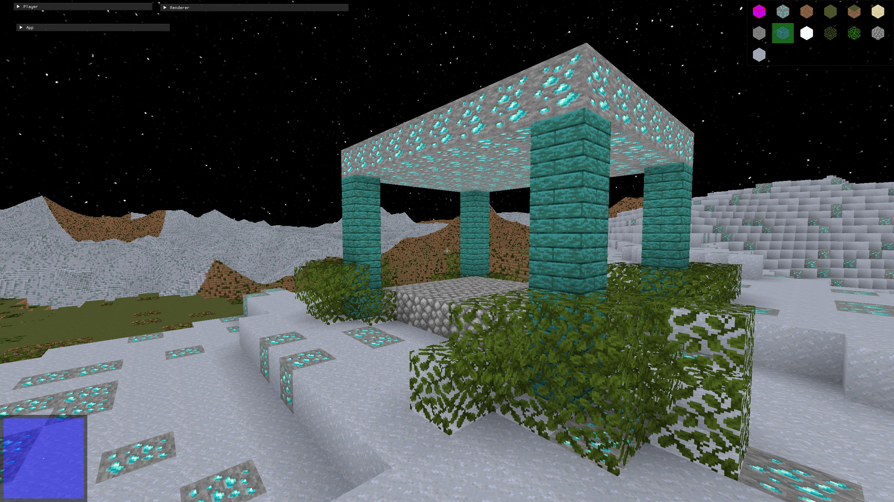
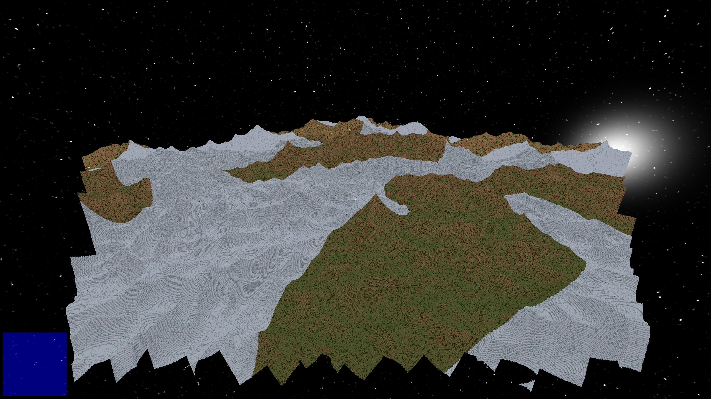
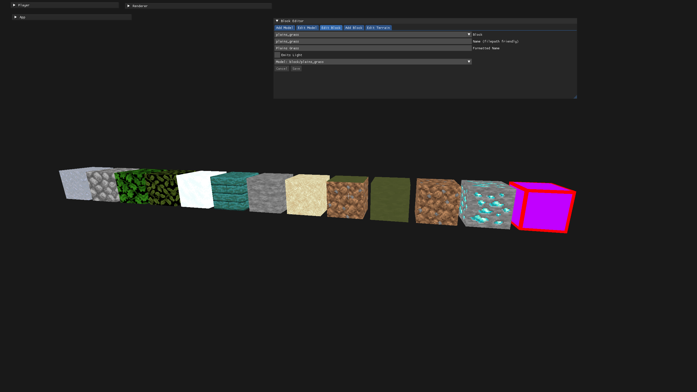
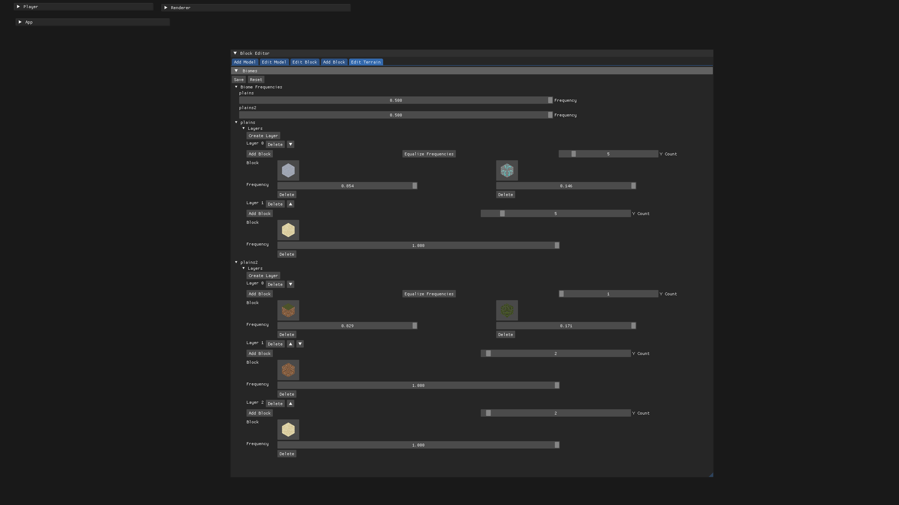
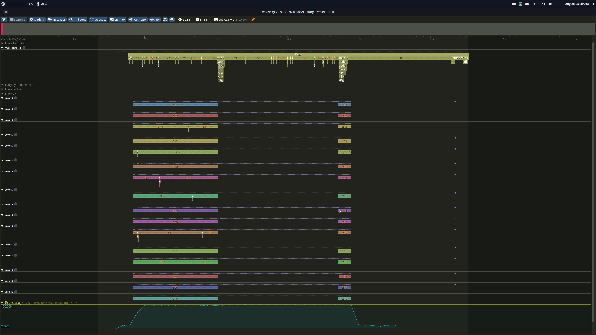
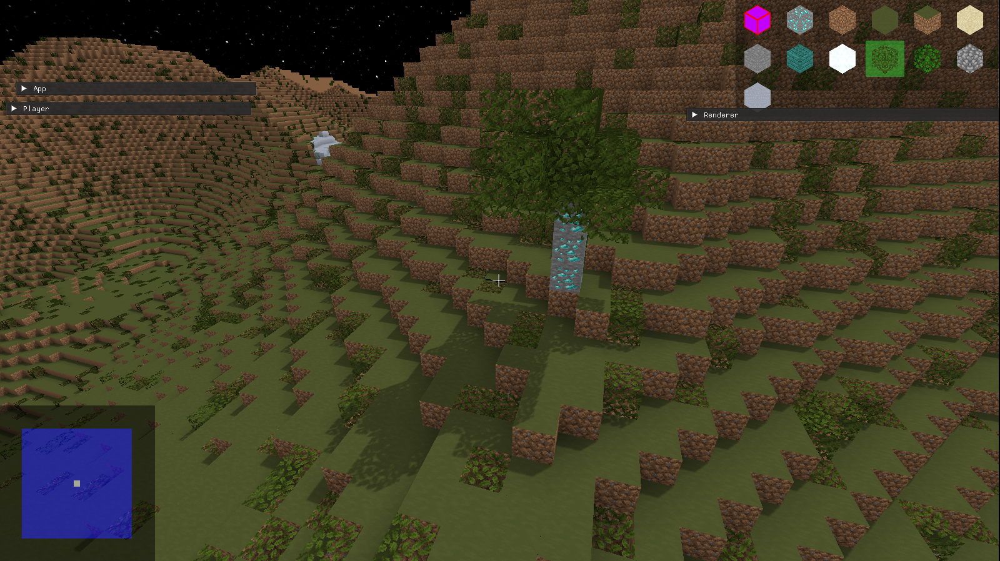

# TCraft

TCraft is a rewrite of my
[previous voxel engine](https://github.com/tonadr1022/VoxelEngine3D) in OpenGL
4.6 and C++. This iteration uses AZDO (Approaching Zero Driver Overhead)
techniques to reduce driver overhead, particularly
[glMultidrawElementsIndirect](https://registry.khronos.org/OpenGL-Refpages/gl4/html/glMultiDrawElementsIndirect.xhtml)
to draw all objects that use the same vertex format and shader with a single
draw call. In general, my first iteration was quite messy, as it was one of my
first real attempts at writing C++ and OpenGL and hence a learning experience
from other iterations online. This time, though, I actually know the language
and graphics programming (not really, both are a lifelong journey)

## Demos

[Demo Playlist](https://www.youtube.com/playlist?list=PLHcOWdaLwRvwq5tjGYTkSlascX6TRfaxz)

[Demo 2](https://youtu.be/LivS4SBp9Ww)

[Demo 1](https://youtu.be/nuAlO2GmP_g)

## Running Locally

- Clone the repository using `--recursive` and/or run `git submodule update`
  after cloning to add the FastNoise2 submodule.
- This project uses Vcpkg to manage dependencies and will fetch Vcpkg and build
  dependencies using it if Vcpkg is not found on your system.
- Use CMake commands, an IDE, or run
  `python3 tasks.py -cbr --mode <Debug|RelWithDebugInfo|Release>` to configure,
  build and run. Pass individual flags to run only that part of the build/run
  process

## Philosophy

### Rendering with AZDO - Approaching Zero Driver Overhead

#### Indirect Rendering

The first step I took to reduce driver overhead, and thus improve rendering
performance, was to employ indirect rendering. OpenGL versions >= 4.3 support
"glMultidraw\_\_\_Indirect". Using this command is a massive performance win,
since draw command data can be put into a shader storage buffer to allow an
entire scene to be drawn in a single command. Rather than binding a Vertex Array
per mesh, the entire scene's mesh data can be stored in one vertex buffer and
one index buffer, using the multi-draw commands to index into them and draw the
correct meshes.

#### GPU Frustum Culling and Draw Command Generation

In my last iteration of a Minecraft-esque engine, I culled meshes outside the
view frustum on the CPU, testing every bounding box one at a time. This time,
powered by the ability to arbitrarily generate draw commands in a buffer, I
learned to cull meshes in a compute shader and generate the draw command buffer
completely on the GPU. That means meshes are now tested against the view frustum
in parallel. This in itself is faster, and it further reduces overhead by
gnerating the optimal number of draw commands without CPU interaction, other
than dispatching the compute shader and updating the draw command buffer when
meshes are added or removed.

Pipeline Steps:

1. If a chunk mesh allocation or free occurred during a frame, reallocate the
   draw command buffer, uniform shader storage buffer (that stores chunk mesh
   positions (or model matrices if it weren't to be axis aligned)), draw info
   buffer that contains vertex/index offsets and sizes, as well as AABBs.
2. Bind the aforementioned buffers and uniforms including view frustum and clear
   and bind the draw count parameter buffer that's atomically incremented during
   compute execution.
3. Dispatch the frustum cull compute shader and place a barrier for shader storage buffer
4. Bind state for draw command: uniform ssbo, draw commands, draw count
   parameter, vertex array.
5. Draw thousands of chunks with 1 command:
   [glMultiDrawElementsIndirectCount](https://registry.khronos.org/OpenGL/extensions/ARB/ARB_indirect_parameters.txt)

#### Bindless Textures

Aside from GPU-driven drawing, driver overhead can be further reduced using
[bindless textures](https://www.khronos.org/opengl/wiki/Bindless_Texture).
Another shader storage buffer of materials that contain GPU-resident texture
handles is bound, and the each shader invocation can access the material and
textures it needs without the need to bind textures into slots. This can be
optimized further using sparse bindless texture arrays, something I have not
explored yet. This didn't make a massive difference in chunk rendering
performance for this engine, since all chunks use the same texture array, but
when rendering objects with different textures, bindless textures provide
another cool way to reduce driver overhead. The downside with bindless textures
is their lack of support on older GPU's, and their inherent lack of safety.

## Features

### Data Driven Block/Terrain Editor

Rather than hardcode blocks into an enum that needs to be recompiled every time a
new block is added, I use JSON to store block, model, and terrain data. Blocks and terrain can be arbitrarily added and edited
without recompilation using an in-game editor.

### Multi-threading

Rather than implementing my own thread pool (which I'll learn eventually in
Operating Systems class), I use a [BS Thread Pool](https://github.com/bshoshany/thread-pool) to send chunk meshing and
terrain generation tasks to. This massively improves frame-to-frame performance,
since the most CPU heavy tasks are offloaded from the rendering/gameplay thread. I use [Tracy](https://github.com/wolfpld/tracy) profile.

### Screenshots

_Cascaded shadow mapping_

### Other Features

- Cascaded Shadow Mapping
- Block editor to change and add block models and blocks
- Terrain editor to modify biome and terrain content
- World creation
- Block icon generation and use in inventory and editor UIs
- Block breaking and placing
- Baked ambient occlusion
- Efficient greedy meshing
- Orbit and FPS Camera

## TODO

- Better Sky
- Water and transparency
- Multithread texture/data loading
- Chunk serialization
- Better shading and lighting (per-block lighting vs forward+ vs deferred?)

## Dependencies

- [GLEW](https://github.com/nigels-com/glew) - OpenGL extension wrangler
- [GLM](https://github.com/g-truc/glm) - vector math
- [Tracy](https://github.com/wolfpld/tracy) - Profiling
- [Spdlog](https://github.com/gabime/spdlog) - Logging
- [SDL2](https://github.com/libsdl-org/SDL) - Window/input handling
- [Nlohmann-json](https://github.com/nlohmann/json)- JSON parse and write
- [Bshoshany-thread-pool](https://github.com/bshoshany/thread-pool) - (I'll
  learn how to make my own after OS this fall)
- [ImGui](https://github.com/ocornut/imgui) - GUI
